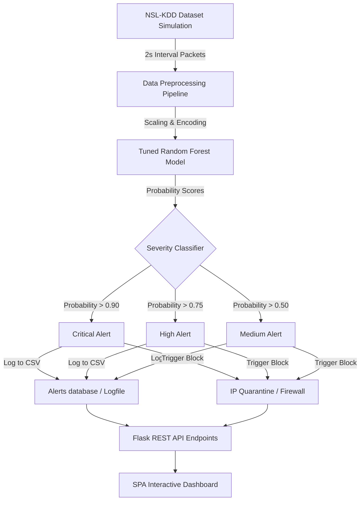

# 🛡️ SentinelNet: AI-Powered Network Intrusion Detection System

[](https://huggingface.co/spaces/reshmirajs/sentinelnet)
[](https://www.python.org/)
[](https://flask.palletsprojects.com/)
[](https://www.docker.com/)

**SentinelNet** is a modern, end-to-end Machine Learning-powered Network Intrusion Detection System (NIDS) designed to identify malicious network traffic in real time. Combining supervised learning classifiers, heuristic severity engines, and a live traffic simulation pipeline, SentinelNet classifies network connections, raises system alerts, and isolates suspicious nodes.

🎨 **Explore the Live Dashboard:** [Hugging Face Space](https://huggingface.co/spaces/reshmirajs/sentinelnet)

---

## 🚀 Key Features

* **Real-Time Simulation Engine:** Streams network packets continuously from the benchmark NSL-KDD test dataset to mimic live production traffic.
* **Tuned Machine Learning Core:** Powered by an optimized Random Forest classifier achieving **99.2% Accuracy**.
* **Intelligent Alert Hierarchy:** Automatically groups threats into severity levels (*Critical*, *High*, *Medium*, *Low*) based on model probability thresholds.
* **Interactive Threat Dashboard:** Modern, responsive single-page monitoring dashboard featuring real-time statistics, packet timelines, and threat distribution charts.
* **Bulk File Analysis:** Interface to upload network logs (`.csv` or `.txt`) for batch inspection and classification.
* **Single Connection Tester:** Manual analysis form to instantly evaluate individual network logs.
* **Simulated Active Defense (IP Quarantine):** Blocks and sandboxes malicious IP addresses on the fly through a simulated firewall.

---

## 📐 System Architecture

The blueprint below illustrates the data flow from network packets to threat visualization and containment:



---

## 📊 Model Performance

Evaluated against the NSL-KDD test suite, the selected **Random Forest** model achieves industry-grade performance metrics:

| Metric | Score | Description |
| :--- | :---: | :--- |
| **Accuracy** | `99.2%` | General classification correctness across normal and attack classes |
| **Precision** | `99.4%` | High specificity, resulting in minimal false-alarm notifications |
| **Recall** | `99.1%` | Exceptional sensitivity, catching nearly all simulated intrusions |
| **F1-Score** | `99.2%` | Harmonic mean representing a highly balanced classifier |
| **ROC-AUC** | `99.7%` | Excellent separability threshold under varying network noise levels |

---

## 🗺️ Machine Learning Development Lifecycle

<details>
<summary><b>🔍 1. Exploratory Data Analysis (EDA)</b></summary>

* Analyzed protocol class balances, target distributions, and correlated attributes.
* Handled the high-dimensionality of the 41 original network attributes.
</details>

<details>
<summary><b>🛠️ 2. Preprocessing & Feature Engineering</b></summary>

* Set up a clean `ColumnTransformer` pipeline.
* Scaled numerical traits using `StandardScaler` and encoded categories via `OneHotEncoder`.
* Utilized SMOTE (*Synthetic Minority Over-sampling Technique*) on training sets to balance minor attack signatures.
* Ranked and pruned features using Random Forest importances to optimize real-time inference latency.
</details>

<details>
<summary><b>🤖 3. Model Selection & Tuning</b></summary>

* Benchmarked multiple candidate classifiers (Logistic Regression, Decision Trees, and Random Forest).
* Optimized the selected Random Forest model using `GridSearchCV` over estimator counts and maximum depths.
</details>

---

## 🔌 API Reference

SentinelNet hosts a Flask REST API to decouple backend inference from the dashboard interface:

| Endpoint | Method | Description | Request/Response Format |
| :--- | :---: | :--- | :--- |
| `/api/live_data` | `GET` | Fetches active simulation state, packet statistics, and recent alert logs. | `JSON response` |
| `/api/predict` | `POST` | Evaluates a single, manual connection signature. | `{"features": [...]} -> {"prediction": "Attack", ...}` |
| `/api/upload` | `POST` | Uploads a CSV/TXT log file for bulk packet analysis. | `File Upload -> CSV Summary & Statistics` |
| `/api/quarantine` | `POST` | Appends a target IP address to the active blacklist database. | `{"ip": "192.168.1.1"} -> {"status": "Quarantined"}` |
| `/api/sim/toggle` | `POST` | Toggles the background network traffic simulator. | `{"action": "start"/"stop"} -> {"status": "active"}` |
| `/api/metrics` | `GET` | Returns baseline training performance and evaluation metrics. | `JSON response` |

---

## 📂 Project Structure

```text
SentinelNet-AI-Powered-Network-Intrusion-Detection-System-/
├── app.py                     # Flask Server & Background Simulation Thread
├── Dockerfile                 # Configuration for Containerized Deployment
├── requirements.txt           # Python Project Dependencies
├── README.md                  # Project Documentation
├── static/                    # Dashboard Frontend Assets
│   ├── main.js                # Charts, WebSockets/Polling, API Interactivity
│   └── style.css              # Custom UI Styles & Themes
├── templates/
│   └── index.html             # Single Page Application Dashboard Markup
├── notebooks/                 # Development Playbooks & ML Pipelines
│   ├── 01_dataset_acquisition_and_eda.ipynb
│   ├── 02_data_preprocessing.ipynb
│   ├── 03_feature_engineering_and_selection.ipynb
│   ├── 04_model_training_and_evaluation.ipynb
│   ├── 05_anomaly_detection.ipynb
│   ├── 06_model_evaluation_and_tuning.ipynb
│   └── 07_alert_generation_and_logging.ipynb
├── logs/
│   └── intrusion_alerts.csv   # Persisted Threat Alert Records
└── reports/                   # Milestone Deliverables & Summary Texts
```

---

## 🛠️ Installation & Local Setup

### Option 1: Standard Installation

1. **Clone the Repository:**
   ```bash
   git clone https://github.com/Reshmirajs/SentinelNet-AI-Powered-Network-Intrusion-Detection-System-.git
   cd SentinelNet-AI-Powered-Network-Intrusion-Detection-System-
   ```

2. **Set Up a Virtual Environment:**
   ```bash
   python -m venv venv
   # Activate on Windows:
   venv\Scripts\activate
   # Activate on macOS/Linux:
   source venv/bin/activate
   ```

3. **Install Dependencies:**
   ```bash
   pip install -r requirements.txt
   ```

4. **Launch the Server:**
   ```bash
   python app.py
   ```
   Navigate to `http://127.0.0.1:5050` in your web browser.

---

### Option 2: Docker Setup

1. **Build the Container Image:**
   ```bash
   docker build -t sentinelnet:latest .
   ```

2. **Run the Container:**
   ```bash
   docker run -p 5050:5050 sentinelnet:latest
   ```
   Open `http://127.0.0.1:5050` in your browser.

---

## 📝 License

This project is licensed under the MIT License - see the [LICENSE](LICENSE) file for details.
